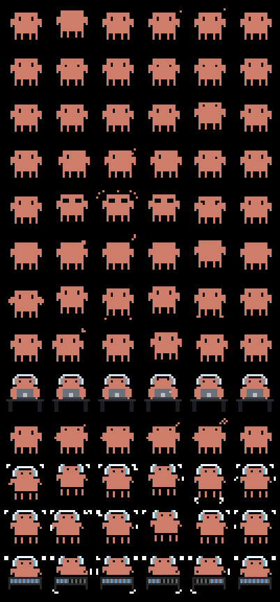

<p align="center">
  
</p>

<h1 align="center">claudepix</h1>

<p align="center">
  <strong>An animated pixel creature for embedded screens — <code>no_std</code>, zero-alloc, and a pure animation clock so it moves without a timer.</strong>
</p>

<p align="center">
  
  
  
  
</p>

A tiny Rust library that puts a 20×20 [ClaudePix](https://claudepix.vercel.app/) creature —
one that **breathes**, **blinks**, **dances**, and **codes** — onto any
[`embedded-graphics`](https://crates.io/crates/embedded-graphics) `DrawTarget`. The same
code drives an on-target panel (it was written for the ST7789 on an M5StickC Plus) and a
host framebuffer, so the whole thing is testable without a device attached.

---

## The problem

Putting a small *animated* sprite on a microcontroller screen usually means one of two bad
trades:

- **Store full frames.** A 20×20 `Rgb565` frame is 800 bytes; a 16-frame loop is ~13 KB of
  flash — and you still hand-roll the timing, the transparency, and the "erase last frame
  without flashing" dance yourself.
- **Decode at runtime.** A GIF/APNG decoder needs an allocator and frame buffers you don't
  have on a 520 KB, no-PSRAM chip.

## The solution

`claudepix` packs each frame to **4-bit palette indices, two per byte** — 200 bytes a frame,
nothing to decode at boot — and hands you the animation as a **pure function of elapsed
milliseconds**. You ask *"what should be on the glass now?"*; you get a frame. No timer, no
mutable cursor, no allocator.

### Why use it

| | claudepix |
|---|---|
| **Flash** | ~200 B/frame · ~43 KB for all 13 presets · name one sprite, link only that one |
| **Runtime cost** | zero decode, zero alloc — frames live in `.rodata` |
| **Animation** | `sprite.frame_at(elapsed_ms)` — a pure function; survives `u64::MAX` ms |
| **Rendering** | `draw_onto` erases its own box in **one contiguous fill** — no flash, no dropped frames |
| **Transparency** | palette index 0 is transparent; composite over any background |
| **Portability** | any `DrawTarget<Color = Rgb565>` — panel on-device, framebuffer on host |
| **Safety** | `#![no_std]`, `#![forbid(unsafe_code)]` |

---

## Quick example

```rust
use claudepix::sprite::{self, IDLE_BREATHE};
use embedded_graphics::pixelcolor::Rgb565;
use embedded_graphics::prelude::*;

/// Call this from your render loop with the milliseconds since the animation began.
fn tick<D: DrawTarget<Color = Rgb565>>(screen: &mut D, elapsed_ms: u64) -> Result<(), D::Error> {
    // What should be on the glass now? A pure function of time.
    let frame = IDLE_BREATHE.frame_at(elapsed_ms);

    // Paint at 3× scale, overwriting the sprite's own box so successive frames
    // neither smear nor flash. `draw_onto` is the one you want in a loop.
    sprite::draw_onto(screen, &IDLE_BREATHE, frame, Point::new(0, 0), 3, Rgb565::BLACK)
}
```

Only repaint when the picture actually changes — `frame_index_at` returns the index, so a
loop can compare it against what it last drew and skip the write:

```rust
let idx = IDLE_BREATHE.frame_index_at(elapsed_ms);
if idx != last_drawn {
    let frame = &IDLE_BREATHE.frames()[idx];
    sprite::draw_onto(screen, &IDLE_BREATHE, frame, origin, 3, Rgb565::BLACK)?;
    last_drawn = idx;
}
```

---

## The library

13 presets, in four categories. Each is a `pub static` you can name directly, or reach
through `sprite::ALL`.

| Category | Presets |
|---|---|
| **Idle** | `IDLE_BREATHE`, `IDLE_BLINK`, `IDLE_LOOK_AROUND` |
| **Expression** | `EXPRESSION_WINK`, `EXPRESSION_SURPRISE`, `EXPRESSION_SLEEP` |
| **Dance** | `DANCE_BOUNCE`, `DANCE_SWAY`, `DANCE_BOUNCE_DJ`, `DANCE_SWAY_DJ`, `DANCE_DJMIX` |
| **Work** | `WORK_CODING`, `WORK_THINK` |

---

## Design philosophy

- **The animation is pure.** `frame_at(elapsed_ms)` is the *whole* of the animation logic —
  no timer, no cursor, no frame counter to drift, and no panic at `u64::MAX`. Who owns the
  clock and how often the panel repaints is the caller's problem, not the library's.
- **The library names no panel.** It draws into any `embedded-graphics` `DrawTarget`. The
  on-device ST7789 and a host framebuffer are two adapters for the same port, so every rule
  is proven on the host before a device is ever attached.
- **Measured against real hardware, not vibes.** `draw_onto` fills its box in one contiguous
  stream. The obvious per-cell version set a fresh panel address window 400 times a frame and
  cost **85 ms** against a 50 ms tick — the creature silently dropped frames and nothing on
  the glass said so. See the doc comment on [`draw_onto`](src/sprite/render.rs).
- **Tests that can catch a mirror.** The creature is left-right symmetric almost everywhere,
  so a transposed or mirrored decode *still looks like a creature*. The unit tests pin the
  decode against the one asymmetric row transcribed from upstream, and every vendored frame
  is frozen against browser-verified digests — a false green a screenshot could never catch.

---

## Alternatives

For putting a small animated sprite on an `embedded-graphics` screen:

| Approach | Flash, 16-frame 20×20 clip | `no_std` + alloc-free | Animation clock | In-place erase | Transparency |
|---|---|---|---|---|---|
| **claudepix** | **~3.2 KB** (200 B/frame) | ✅ | ✅ built in | ✅ one contiguous fill | ✅ index 0 |
| `ImageRaw` / `tinytga` per frame | ~12.8 KB (800 B/frame) | ✅ | ❌ DIY | ❌ clear + redraw | ❌ DIY |
| Hand-rolled per-pixel blit | varies | ✅ | ❌ DIY | ❌ DIY | ❌ DIY |
| Runtime GIF/APNG decode | small flash, **large RAM** | ❌ needs decoder + buffers | ✅ | depends | ✅ |

---

## Installation

Not on crates.io — add it straight from git:

```toml
[dependencies]
claudepix = { git = "https://github.com/igouss/claudepix-rs" }
embedded-graphics = "0.8"
```

Pin a revision for reproducible builds:

```toml
claudepix = { git = "https://github.com/igouss/claudepix-rs", rev = "REPLACE_WITH_COMMIT" }
```

Or vendor it as a path dependency:

```sh
git clone https://github.com/igouss/claudepix-rs vendor/claudepix
```
```toml
claudepix = { path = "vendor/claudepix" }
```

There are no runtime dependencies beyond `embedded-graphics`. The `testing` feature adds a
host `Framebuffer` (used by tests and downstream tests); it pulls in `alloc` and never
belongs in a firmware build.

---

## Quick start

1. **Add the dependency** (above).
2. **Pick a creature** — a named `static` like `sprite::WORK_CODING`, or iterate `sprite::ALL`.
3. **Track elapsed milliseconds** since the animation began, from whatever clock you own.
4. **In your loop, ask and paint:**
   ```rust
   let frame = sprite::WORK_CODING.frame_at(elapsed_ms);
   sprite::draw_onto(&mut screen, &sprite::WORK_CODING, frame, Point::new(0, 0), 3, Rgb565::BLACK)?;
   ```
5. **(Optional) skip redundant paints** by comparing `frame_index_at` to the last index drawn.
6. **See them all** without a device:
   ```sh
   cargo run --example sprites   # → target/screens/sprites.png
   ```

---

## API reference

| Item | What it does |
|---|---|
| `Sprite` | A named animation: palette + ordered frames. |
| `Sprite::frame_at(elapsed_ms) -> &Frame` | The frame showing now — the whole animation clock, pure. |
| `Sprite::frame_index_at(elapsed_ms) -> usize` | Same, as an index, so a loop can skip an unchanged repaint. |
| `Sprite::frames() -> &[Frame]` | The frames, in order. |
| `Sprite::loop_ms() -> u32` | Duration of one full loop. |
| `Sprite::colour(index) -> Option<Rgb565>` | Palette lookup; `None` where transparent. |
| `Sprite::slug()` / `category()` | The upstream preset name and category. |
| `Frame::index_at(x, y) -> u8` | The 4-bit palette index at a cell (`0` = transparent, off-grid too). |
| `Frame::hold_ms() -> u16` | How long the frame holds. |
| `sprite::draw(target, sprite, frame, origin, scale)` | Composite over an existing background **once**; skips transparent cells. |
| `sprite::draw_onto(target, sprite, frame, origin, scale, background)` | Animate in place: fills its box in one pass, erasing the previous frame. |
| `sprite::ALL` | Every preset, in manifest order. |
| `testing::Framebuffer` | *(feature `testing`)* a host `DrawTarget` that counts pixels that escape its canvas. |

Both `draw` functions return the target's own `Error` — a sprite paint either writes pixels
or fails exactly the way the panel bus failed.

---

## Architecture

```
 gen/frames.json  ──(bb gen/generate.clj)──►  src/sprite/generated.rs
 vendored 20×20 grids   │ validates invariants,     Sprite / Frame statics,
 + hold_ms per frame    │ pins browser-verified      4-bit packed, in .rodata
                        │ sha256 digests
                        ▼
        Sprite ── frame_at(elapsed_ms) ──►  &Frame ──┐   pure; you own the clock
        (palette + frames)                           │
                                                      ▼
                          draw / draw_onto  ──►  impl DrawTarget<Color = Rgb565>
                                                      ├─ ST7789 panel        (on device)
                                                      └─ testing::Framebuffer (on host)
```

The frames are **generated, not hand-edited**: `gen/generate.clj` (babashka) turns
`gen/frames.json` into `src/sprite/generated.rs` and refuses to do so unless the JSON still
hashes to the frozen digests. No JavaScript lives in the repo.

---

## Develop

```sh
just ci              # fmt-check · sprites-check · clippy -D warnings · test
just sprites         # regenerate src/sprite/generated.rs from gen/frames.json
just sprites-check   # fail if generated.rs has drifted (CI guard)
just sprite-screens  # render the contact sheet
just test            # cargo test --all-features
```

Requires [`babashka`](https://babashka.org/) (`bb`) and `rustfmt` for the generator recipes.

---

## Troubleshooting

| Symptom | Cause / fix |
|---|---|
| Creature renders as a **solid box** | Palette index 0 must be transparent. Custom frames must keep `"transparent"` at index 0 — the generator asserts this. |
| Animation **flickers or smears** | Use `draw_onto` (it erases its box) in the loop, not `draw` (which composites and leaves the previous frame behind). |
| Creature **drops frames** / paint outruns the tick | You're doing per-cell fills. `draw_onto` does one contiguous fill; also lower `scale`, or repaint only when `frame_index_at` changes. |
| `sprites-check` reports **STALE** | Run `just sprites` — `generated.rs` must byte-match the generator's output. |
| Colours look **swapped** | `Rgb565` quantization is done at generation; a channel swap lives below `DrawTarget` (the panel's colour order) and only the real panel can prove it. |
| Edited frames **don't take** | The digest guard rejects an edited `frames.json`; update `verified-digests` in `gen/generate.clj` deliberately, never to force a build green. |

---

## Limitations

- **20×20 grid, `Rgb565` only.** No other sizes or colour formats.
- **Frames are compile-time `static`s.** No runtime loading; changing the art means
  regenerating (needs `bb` + `rustfmt`).
- **The bundled art is the ClaudePix set.** To ship *your own* creature, replace
  `gen/frames.json`, set the new digests in `gen/generate.clj`, and run `just sprites`.
- **Integer-millisecond timing.** Sub-millisecond precision isn't modeled.
- **No transforms.** Place with `origin` and `scale`; there's no rotation or reflection.

---

## FAQ

**Does it need an allocator?**
No. The library is `no_std` and alloc-free. `alloc` is pulled in only by the `testing`
feature (and the crate's own tests), never by a firmware build.

**Does it only run on the M5StickC Plus / ESP32?**
No. It targets any `DrawTarget<Color = Rgb565>`. The ST7789 panel is just one adapter; a
host framebuffer is another.

**How much flash does it cost?**
About 200 bytes per frame — ~43 KB for all 13 presets. Each sprite is its own `static`, so
naming one links only that one.

**How do I avoid repainting every tick?**
Compare `frame_index_at(elapsed_ms)` to the last index you drew and skip the write when
they're equal. The creature only needs a repaint when the frame actually changes.

**Can I use my own pixel art?**
Yes — replace `gen/frames.json`, set its digests, and regenerate. The format, clock, and
renderer don't care where the frames came from.

**Why is there Clojure in a Rust repo?**
Only the offline generator (`gen/generate.clj`, babashka). It runs at build-authoring time,
not at runtime; there's no JavaScript and no Clojure dependency in the shipped crate.

**Does the creature animate on its own?**
No — you pass it elapsed milliseconds and it tells you which frame to draw. It's a pure
function; you own the clock and the loop.

---

## Credits

The creature artwork is the [**ClaudePix**](https://claudepix.vercel.app/) pixel-animation
library. See [ATTRIBUTION.md](ATTRIBUTION.md) for provenance and how the 216 frames were
verified against the live site.

---

## About Contributions

Please don't take this the wrong way, but I do not accept outside contributions for any of
my projects. I simply don't have the mental bandwidth to review anything, and it's my name
on the thing, so I'm responsible for any problems it causes; thus, the risk-reward is highly
asymmetric from my perspective. I'd also have to worry about other "stakeholders," which
seems unwise for tools I mostly make for myself for free. Feel free to submit issues, and
even PRs if you want to illustrate a proposed fix, but know I won't merge them directly.
Instead, I'll have Claude or Codex review submissions via `gh` and independently decide
whether and how to address them. Bug reports in particular are welcome. Sorry if this
offends, but I want to avoid wasted time and hurt feelings. I understand this isn't in sync
with the prevailing open-source ethos that seeks community contributions, but it's the only
way I can move at this velocity and keep my sanity.
